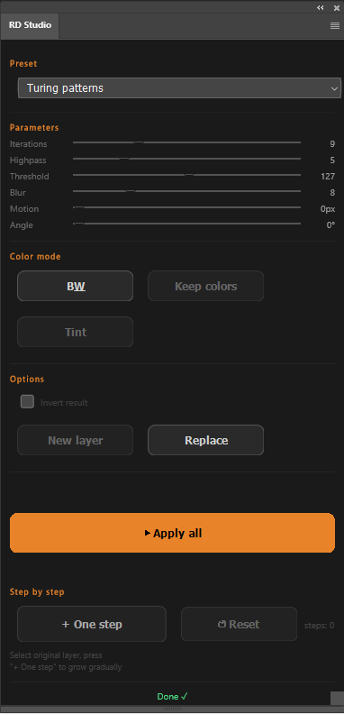

# RD_Plugin
Reaction Diffusion Plugin for Photoshop

# RD Studio — Photoshop Plugin

A free Photoshop plugin that applies Reaction Diffusion patterns to text and images using native PS filters. Inspired by [Jason Webb's Reaction Diffusion Playground](https://jasonwebb.github.io/reaction-diffusion-playground/).

---

## What it does

Takes any layer — text, image, shape — and runs a Reaction Diffusion filter chain on it (Highpass → Threshold → Gaussian Blur, repeated). The result is organic, generative patterns like mazes, fingerprints, coral, spots and more.

- **13 presets** — Mazes, Fingerprints, Spots, Coral, Waves, Worms, Turing, Solitons, Chaos, Soft, Directional, Spin
- **Full parameter control** — iterations, highpass radius, threshold, blur, motion blur, angle
- **3 color modes** — B&W, Keep original colors, Tint with custom colors
- **Step by step mode** — apply one iteration at a time, stop when it looks right
- **Invert** option

---

## Requirements

- Adobe Photoshop 26+
- [Adobe UXP Developer Tool](https://developer.adobe.com/photoshop/uxp/2022/guides/devtool/)

---

## Installation

**1. Enable Developer Mode in Photoshop**

Go to `Plugins → Development → Enable Developer Mode`, restart Photoshop.

**2. Download this plugin**

Click the green **Code** button → **Download ZIP** → unzip it.

**3. Install Adobe UXP Developer Tool**

Download from [developer.adobe.com](https://developer.adobe.com/photoshop/uxp/2022/guides/devtool/) and install.

**4. Load the plugin**

- Open UXP Developer Tool
- Click **Add Plugin**
- Navigate to the unzipped folder and select `manifest.json`
- Click **Load**

The plugin will appear in Photoshop under `Plugins → RD Studio`.

---

## How to use

1. Open a document in Photoshop
2. Select a layer (text, image, anything)
3. Open the RD Studio panel: `Plugins → RD Studio`
4. Choose a preset or adjust parameters manually
5. Press **▶ Apply all** — or use **+ One step** to grow the pattern gradually

### Step by step mode

Select your original layer, then press **+ One step** repeatedly. Each press adds one iteration. Press **↺ Reset** to start over from the original.

### Color modes

- **B&W** — classic high contrast black and white
- **Keep colors** — RD pattern overlays original colors via Multiply blend
- **Tint** — map dark/light colors onto the RD result (gradient map)

---

## Parameters

| Parameter | What it does |
|-----------|-------------|
| Iterations | How many times the filter chain repeats |
| Highpass | Controls the scale/frequency of the pattern |
| Threshold | Hard cutoff — higher = finer detail |
| Blur | Smoothing between iterations — affects pattern softness |
| Motion | Motion blur distance — creates directional flow |
| Angle | Direction of motion blur |

---

## Made by

Evelyn

Free to use, share, modify. No warranty.

If you make something cool with it, I'd love to see it.

